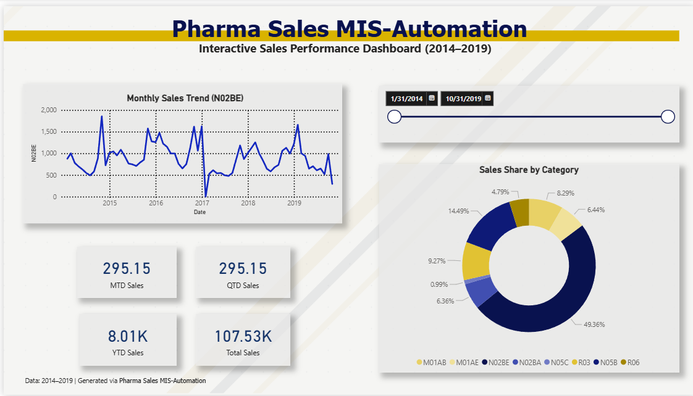

# Pharma Sales MIS Automation

An automated MIS reporting pipeline for pharmaceutical sales data — combining SQL, Python, and AI to cut the manual reporting cycle from hours to seconds, while keeping a human in control of anything that gets sent out.

## The Problem

MIS/reporting teams spend hours every week pulling numbers into dashboards and then manually writing the plain-English summary that leadership actually reads. The dashboard shows *what* happened — someone still has to interpret it. This project automates that interpretation step, without removing human oversight from anything that leaves the building.

## Pipeline

1. **SQL (SQLite)** — real pharma sales data (2014–2019, 8 drug categories) loaded into a queryable database. Includes joins, window functions (`LAG`), and aggregate queries.
2. **Python KPI + Rule Engine** — calculates month-over-month % change per category, ranks the top 3 movers, and tags each with a rule-based reason (increase/decrease/stable) *before* any AI is involved.
3. **AI Narrative Layer (Gemini API)** — takes the ranked, rule-tagged KPIs and writes the executive summary in plain English, following a strict markdown template so output format stays consistent.
4. **Trust & Traceability Footer** — every AI-generated report ends with its data source, generation timestamp, number of KPIs analyzed, and a `Status: Human Review Required` flag.
5. **PDF Export** — the report is rendered into a shareable PDF.
6. **Human-in-the-Loop Delivery** — the pipeline drafts an email (as a `.eml` file, opens directly in Outlook) with the report attached. **It never sends automatically** — a human must review and click send themselves. This is a deliberate design choice: in a real enterprise environment, no AI-generated report should go to leadership unedited.
7. **Power BI Dashboard** — MTD/QTD/YTD DAX measures, trend visualization, category breakdown.
8. **Scheduled Automation** — the entire pipeline (steps 1–6) runs on a schedule via Windows Task Scheduler, regenerating the report with zero manual intervention.
9. **Excel/Power Query Companion Report** — the same SQL data is also transformed via Power Query (unpivoting wide category columns into a clean long format) and summarized in a PivotTable/PivotChart, demonstrating the Excel-native MIS reporting workflow alongside the automated pipeline.

## A Real Data Quality Catch

While building the KPI engine, every category showed a "notable decrease" of 60–90% in the same month — a red flag, since real sales categories don't crash simultaneously. Investigation (`check_dates.py`) revealed the latest month in the dataset was incomplete (8 days of data, not 30), making it look like a collapse. The fix: exclude incomplete periods before calculating month-over-month change. This is left in the repo deliberately — catching bad data before drawing conclusions from it is a core part of the job.

## Tech Stack
SQL (SQLite) · Python (Pandas) · Google Gemini API · Power BI (DAX) · Windows Task Scheduler

## Setup
1. Clone this repo
2. `pip install -r requirements.txt` (or install packages individually: pandas, google-genai, python-dotenv, fpdf2, pywin32)
3. Create a `.env` file with `GEMINI_API_KEY=your_key_here`
4. Run `python run_pipeline.py`

## Files
- `load_to_db.py` — loads CSV into SQLite
- `sql_queries.py` — example SQL: aggregation + window functions
- `kpi_engine.py` — KPI calculation + rule-based tagging
- `check_dates.py` — data quality investigation script
- `ai_summary.py` — AI narrative generation
- `export_pdf.py` — PDF report export
- `draft_email.py` — human-in-the-loop email draft generation
- `run_pipeline.py` — runs the full pipeline end-to-end